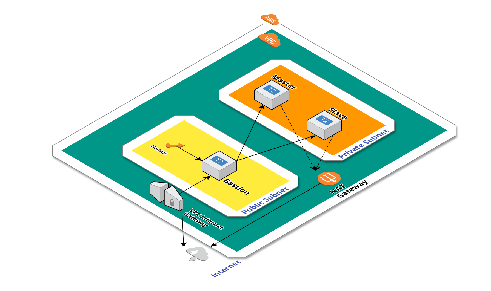
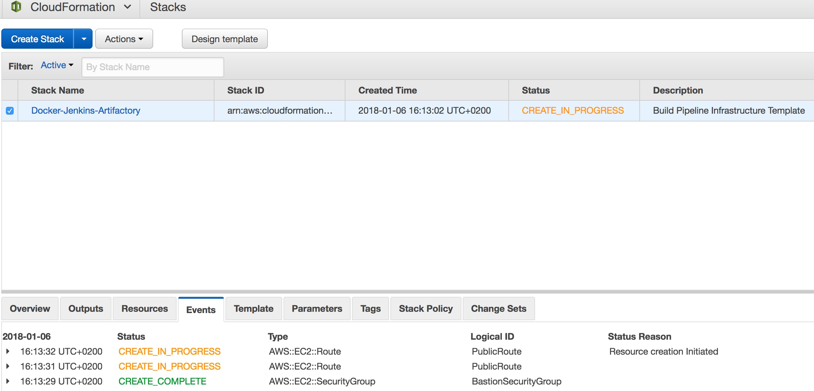
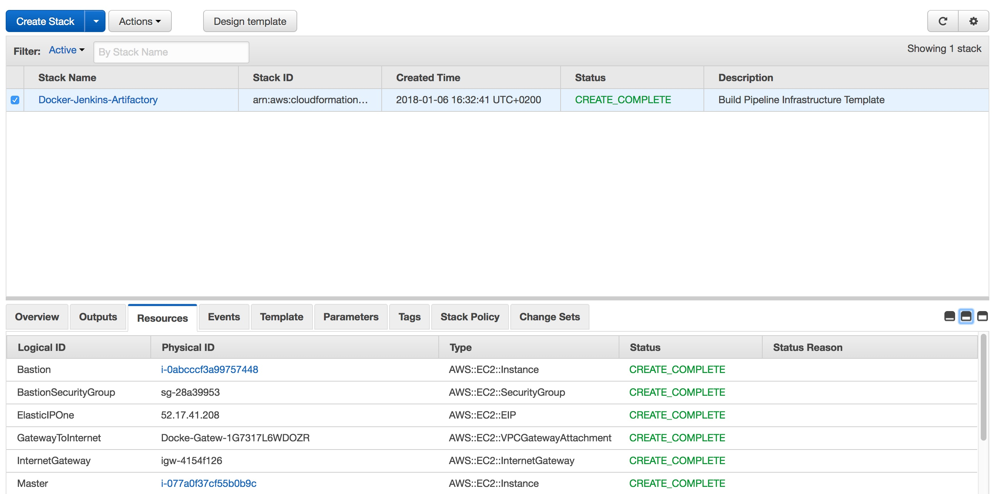
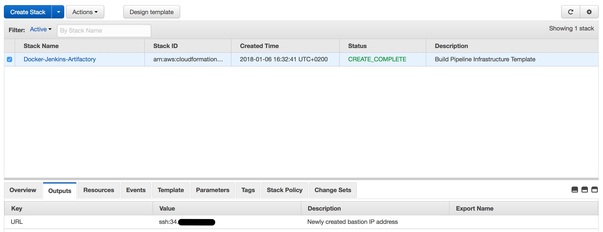

# AWS CloudFormation Stack Deployment

**This template will launch the following resources in AWS:**

| Resource | Description                           | Notes                                        |
| -------- | ------------------------------------- | -------------------------------------------- |
| VPC      | AWS VPC with public & private subnets | IGW & NAT Gateway included with full routing |
| Bastion | EC2 Instance with public SSH access and routing to the private subnet | EIP will show up in CloudFormation output section |
| Master | EC2 Instance with static IP - 10.0.2.10 | |
| Slave | EC2 Instance with static IP - 10.0.2.11 | |

Requierments

- AWS Account
- KeyPair in the region you will deploy the stack

Usage:

- Launch AWS CloudFormation
- Go to Design Template
- Copy-paste the contents of the [template](./Docker-Jenkins-Artifactory.yaml) file into the template tab at the bottom of the window
- Click on the create stack button at the top and launch the stack
- Choose your instance sizes, configure who is allowed SSH access to the instances and choose the KeyPair you prepared in advanced (you will use it to access the instances)

## In progress....

## Completed!

### Bastion IP

